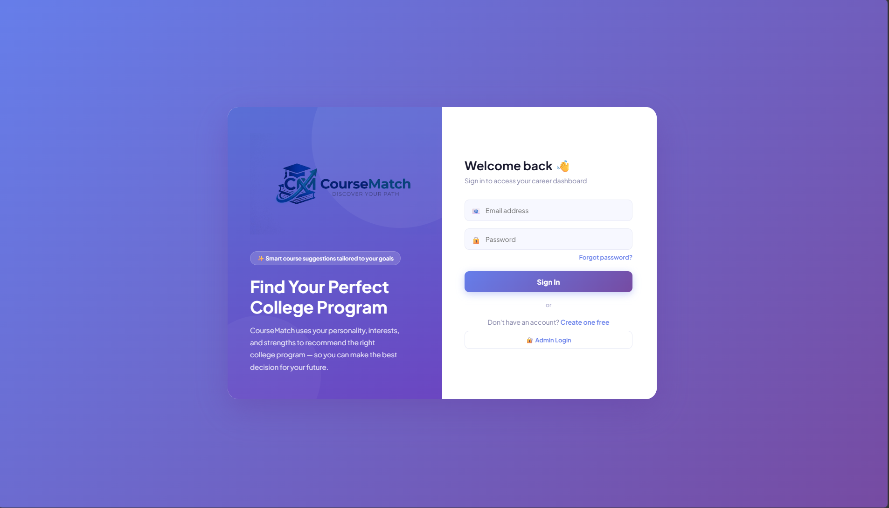
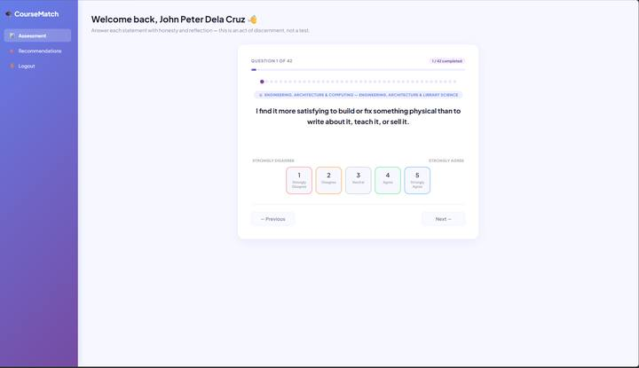

# CourseMatch

CourseMatch is a PHP/MySQL web application that helps students explore college programs through a **30-question RIASEC interest assessment**. It combines student authentication, assessment history, program-fit scoring, password recovery, and an administrative dashboard in one multi-role system.

## Highlights

- 30-question RIASEC assessment covering Realistic, Investigative, Artistic, Social, Enterprising, and Conventional interests
- Draft assessment progress survives page refreshes during the current browser session
- Server-backed student sessions and assessment history
- Ranked program recommendations with a radar profile, trait breakdown, and explainable fit scores
- Student registration, login, logout, password reset, and account recovery
- Role-based administrator dashboard
- Up to three stored assessment attempts per student
- Responsive student UI with desktop sidebar and mobile bottom navigation
- Environment-based configuration so database and mail credentials are not stored in source files
- Reproducible SQL schema included in the repository


## Project preview

### Login


### Assessment


### Career Report


## Technology

- HTML5 and CSS3
- Vanilla JavaScript
- PHP
- MySQL / MariaDB
- Chart.js
- PHPMailer

## Project structure

```text
CourseRecommender/
├── index.html              # Student sign in
├── register.html           # Student registration
├── dashboard.html          # RIASEC assessment
├── result.html             # Profile and recommendations
├── admin.html              # Administrator dashboard
├── script.js               # Shared auth/API helpers
├── assessment.js           # Assessment state and draft persistence
├── recommender.js          # Program-fit scoring engine
├── results.js              # Results rendering
├── modern.css              # Modern student UI layer
├── student_api.php         # Authenticated student session/attempt API
├── admin_api.php           # Role-protected administration API
├── session_bootstrap.php   # Shared secure session configuration
├── config.php              # Environment configuration loader
├── db_connect.php          # Centralized database connection
├── send-reset.php          # Password reset email flow
├── reset-password.php      # Token validation and password update
├── database/
│   └── schema.sql          # Database schema
├── src/                    # PHPMailer source
├── .env.example            # Local configuration template
└── .gitignore
```

## Recommendation model

Each RIASEC trait contains five questions scored from **1 to 5**, producing a raw trait score from **5 to 25**.

The recommendation engine normalizes the six trait scores and compares the resulting student profile with a weighted trait profile for each program. The current fit score combines:

- 45% profile-shape similarity
- 30% ranked-trait similarity
- 25% absolute trait fit

Programs whose primary trait is substantially below the student's profile receive a penalty. The result is a **CourseMatch profile-fit score**, not an admission probability, aptitude test result, or guarantee of career success.

## Local setup

### 1. Clone the project

```bash
git clone https://github.com/Arondith/CourseRecommender.git
cd CourseRecommender
```

### 2. Configure the environment

Copy the example file:

```bash
cp .env.example .env
```

On Windows you can duplicate `.env.example` and rename the copy to `.env`.

Update the database values in `.env`. If you want password-reset emails to work, also configure the mail variables.

```env
APP_URL=http://localhost/CourseRecommender

DB_HOST=localhost
DB_PORT=3306
DB_NAME=coursematch_db
DB_USER=root
DB_PASS=

MAIL_HOST=smtp.gmail.com
MAIL_PORT=587
MAIL_USERNAME=your-email@example.com
MAIL_PASSWORD=your-app-password
MAIL_FROM_ADDRESS=your-email@example.com
MAIL_FROM_NAME=CourseMatch
```

Never commit your real `.env` file.

### 3. Create the database

Start MySQL/MariaDB through XAMPP, WAMP, or Laragon and import:

```text
database/schema.sql
```

The schema creates the required:

- `students`
- `admins`
- `student_attempts`
- `password_resets`

tables.

### 4. Run through a PHP web server

Place the repository inside your local server's web root, start Apache and MySQL, then open the project through an HTTP URL such as:

```text
http://localhost/CourseRecommender/
```

Do not open the HTML files directly with `file://`, because authentication and persistence depend on PHP sessions and API requests.

## Administrator setup

Administrator passwords must be stored as PHP password hashes, never plain text.

Generate a hash locally:

```bash
php -r "echo password_hash('CHANGE_THIS_PASSWORD', PASSWORD_DEFAULT), PHP_EOL;"
```

Then insert the generated hash into the `admins` table with one of these roles:

- `superadmin`
- `moderator`
- `viewer`

Change or remove any bootstrap credentials after setup.

## Security notes

The current codebase includes several safeguards suitable for a student/portfolio project:

- Secrets are loaded from environment configuration
- `.env` is ignored by Git
- Session cookies use HttpOnly, SameSite, and strict-mode session settings
- Session IDs regenerate after successful login
- Database connection errors are logged server-side instead of exposing raw DB details
- Student assessment writes are separated from the admin API
- RIASEC scores are validated server-side before storage
- Password-reset tokens are random, stored as SHA-256 hashes, expire after one hour, and are deleted after use
- Login failures use generic credential messages

For a public production deployment, add HTTPS-only cookies, CSRF tokens, request throttling/rate limiting, dependency management through Composer, automated tests, and production-grade monitoring.

> Removing a credential from the current branch does not remove it from Git history. If a real secret was ever committed, revoke/rotate it with the provider.

## Design direction

The refreshed student experience uses a shared responsive design system across sign-in, registration, assessment, recommendations, and password recovery. The admin interface remains intentionally information-dense while the student side prioritizes clarity, progress, and mobile usability.

## Development note

CourseMatch is an educational software project. Program availability and admission requirements can change, so the recommendation data should be reviewed against the institution's current official program list before real-world deployment.
